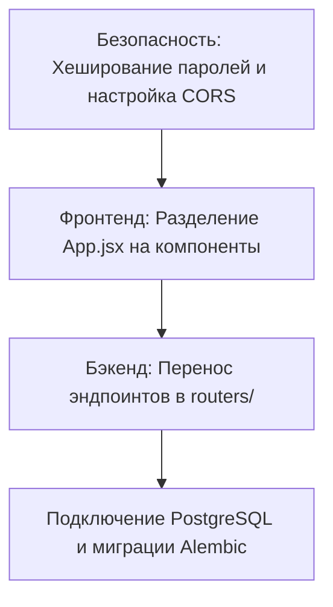

# Жесткий аудит архитектуры и безопасности: OneClick Sandbox

В этом документе представлен детальный критический разбор текущего состояния кодовой базы проекта **OneClick** с указанием конкретных уязвимостей, архитектурных просчетов и путей их решения.

---

## 1. Критические уязвимости безопасности (High Risk)

### 🚨 Хранение паролей в открытом виде (Plain-Text Passwords)
*   **В чем проблема:** В `main.py` при регистрации пользователя пароль сохраняется в БД в исходном текстовом виде. При входе сверка идет через обычное сравнение строк `user.password == login_data.password`.
*   **Последствия:** Если злоумышленник получит доступ к файлу `database.db`, он мгновенно скомпрометирует учетные данные всех пользователей, включая координаторов и волонтеров.
*   **Решение:** Срочно внедрить хеширование с солью с помощью библиотек `bcrypt` или `passlib` (например, алгоритм `bcrypt` или `argon2`).

### 🚨 Небезопасная настройка CORS (`allow_origins=["*"]`)
*   **В чем проблема:** В FastAPI разрешены запросы с абсолютно любых источников (`*`).
*   **Последствия:** Любой сторонний вредоносный сайт, открытый в браузере пользователя, может выполнять запросы к вашему API от имени авторизованного клиента (уязвимость к CSRF/XSS атакам).
*   **Решение:** Ограничить список разрешенных хостов конфигурацией из `.env` файла (например, только `http://localhost:5173`).

### 🚨 Сессии без срока действия и подписи
*   **В чем проблема:** Авторизация держится на передаче сырых `user_id` или простых кук без криптографической подписи.
*   **Последствия:** Любой может подделать ID пользователя в запросе и получить доступ к чужому аккаунту без ввода пароля.
*   **Решение:** Использовать стандарт JWT (JSON Web Tokens) с ограниченным временем жизни (например, 15 минут для access token) и хранением refresh token в защищенных куках с флагами `HttpOnly` и `SameSite`.

---

## 2. Архитектура бэкенда и API

### 📦 Монолитный `main.py` (Размер: ~50 КБ)
*   **В чем проблема:** Все эндпоинты, симуляция отправки OTP, логика регистрации компаний, отзывы и файловые загрузки свалены в один файл.
*   **Последствия:** Поддерживать такой код крайне сложно, возникают конфликты при слиянии веток, а модульное тестирование практически невозможно.
*   **Решение:** Разбить API на логические роутеры:
    ```
    backend/
    ├── routers/
    │   ├── auth.py
    │   ├── shifts.py
    │   ├── organizations.py
    │   └── reviews.py
    ├── core/
    │   ├── config.py
    │   └── security.py
    └── main.py
    ```

### 📦 Использование SQLite в конкурентной среде
*   **В чем проблема:** Параметр `check_same_thread=False` решает проблему многопоточности SQLAlchemy, но при росте числа пользователей SQLite будет лочить базу на запись, вызывая ошибки `database is locked`.
*   **Последствия:** Приложение упадет, когда 2-3 координатора одновременно попытаются одобрить волонтеров или создать смену.
*   **Решение:** Для продакшна использовать PostgreSQL, оставив SQLite только для локальной разработки.

---

## 3. Архитектура фронтенда (Vite + React)

### 🚨 Раздутый `App.jsx` (Размер: >170 КБ, 3300+ строк)
*   **В чем проблема:** Один файл содержит в себе:
    *   Всю глобальную маршрутизацию
    *   Стилизацию и верстку всех экранов (B2C, B2B, Лендинг)
    *   Интеграции с картами (Leaflet)
    *   Сотни обработчиков состояний (State)
    *   Все запросы к API
*   **Последствия:** Любое мелкое изменение в логике смены может сломать авторизацию или профиль. Среда разработки (IDE) начинает тормозить при парсинге файла.
*   **Решение:** Декомпозировать код на изолированные компоненты:
    ```
    src/
    ├── components/
    │   ├── ShiftCard.jsx
    │   ├── LeafletMap.jsx
    │   ├── ProfileAccordion.jsx
    │   └── Navigation.jsx
    ├── hooks/
    │   └── useApi.js
    └── App.jsx
    ```

### 🚨 Смешение Tailwind-классов и inline-стилей
*   **В чем проблема:** Часть компонентов сверстана на Tailwind, а часть использует `style={{ ... }}` с жестко прописанными отступами и высотой.
*   **Решение:** Стандартизировать дизайн-систему, вынести кастомные значения в `tailwind.config.js` или использовать произвольные значения Tailwind (например, `h-[180px]`).

---

## 4. План приоритетных действий


