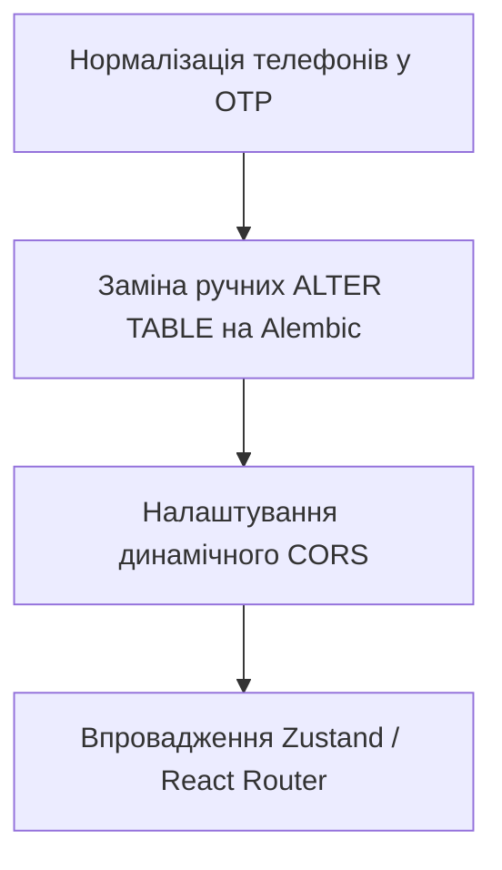

# Детальний технічний аудит та оцінка проекту: OneClick

В даному документі наведено глибокий критичний аналіз поточної архітектури, безпеки, бази даних та інтерфейсу проекту **OneClick** станом на липень 2026 року.

---

## 📊 Оцінка системи (Score Card)

| Критерій | Оцінка | Коментар |
| :--- | :---: | :--- |
| **Безпека (Security)** | **8.5 / 10** | Впроваджено JWT-сесії, хешування паролів (bcrypt) та нормалізацію номерів у логіці OTP. Проте CORS все ще дозволяє будь-які домени (`*`). |
| **Архітектура бэкенда (Backend Architecture)** | **8.5 / 10** | Код розбито на модульні роутери в `backend/routers/`, а для управління схемою бази даних підключено інструмент міграцій **Alembic**. |
| **Архітектура фронтенду (Frontend Architecture)** | **6 / 10** | Компоненти декомпозовано у `src/components/`, але `src/App.jsx` залишається занадто великим монолітом (~1700 рядків) з купою станів, пропс-дріллінгом і відсутністю клієнтського роутингу. |
| **Обробка помилок (Error Handling)** | **8 / 10** | Автоматичний вихід з сесії при 401 помилці від сервера виправлено. Фронтенд надійно очищує недійсні токени. |
| **Загальний бал (Overall Score)** | **7.8 / 10** | **Значний прогрес.** Проект став набагато надійнішим, безпечнішим та структурованішим. |

---

## 🔍 Детальний перелік зауважень та рекомендацій

### 1. Безпека та бізнес-логіка (High Priority)

#### ✅ [ВИПРАВЛЕНО] Потенційна розбіжність при перевірці OTP кодів по телефону
* **Виправлення:** Ендпоінт `/api/auth/send-verification-sms` тепер використовує хелпер `normalize_phone` для нормалізації номера перед збереженням OTP в базу даних. Це гарантує повну сумісність з етапом авторизації/реєстрації, незалежно від формату вводу користувачем.

#### 🚨 Небезпечний CORS (`allow_origins=["*"]`)
* **Проблема:** Дозволено підключення будь-яких доменів до API. Це підвищує ризик CSRF-атак.
* **Рішення:** Обмежити дозволені джерела через змінні оточення (наприклад, дозволяти тільки `frontend_url` з `.env`).

---

### 2. Архітектура бази даних та бэкенда (Medium Priority)

#### ✅ [ВИПРАВЛЕНО] Ручні SQL-міграції в `backend/main.py`
* **Виправлення:** Впроваджено офіційний інструмент міграцій **Alembic**. Всі ручні запити `ALTER TABLE` та супутній код перевірки колонок успішно видалено з `backend/main.py`. Створено початкову схему міграцій, а існуючу базу даних стамповано до версії `head`.

#### 📦 SQLite як єдина БД
* **Проблема:** SQLite підходить для розробки, але не підтримує високу конкурентність при великій кількості волонтерів і координаторів.
* **Рішення:** Налаштувати бэкенд на роботу з **PostgreSQL** за допомогою змінної `DATABASE_URL` у `.env` файлі для продакшну.

---

### 3. Архітектура фронтенду (Medium Priority)

#### 🚨 Розмір та складність `src/App.jsx`
* **Проблема:** `App.jsx` містить у собі весь стан додатка (смени, заявки, активні вкладки, модальні вікна) і прокидає їх вниз через пропси. Зміна стану в одному місці викликає ререндер всього додатка.
* **Рішення:** 
  1. Впровадити легкий стейт-менеджер, наприклад **Zustand** или React Context.
  2. Додати клієнтську маршрутизацію (**React Router**), замість ручного перемикання екранів через стан `currentRole` / `activeB2CTab`.

---

## 🛠️ План дій для покращення проекту (Roadmap)

```mermaid
graph TD
    A[Нормалізація телефонів у OTP] --> B[Заміна ручних ALTER TABLE на Alembic]
    B --> C[Налаштування динамічного CORS]
    C --> D[Впровадження Zustand / React Router]
```

1. **Крок 1:** Додати нормалізацію телефонів у `/send-verification-sms` в `backend/routers/auth.py`.
2. **Крок 2:** Створити Alembic-конфігурацію для управління схемою бази даних.
3. **Крок 3:** Винести дозволені CORS-джерела у файл конфігурації `.env`.
