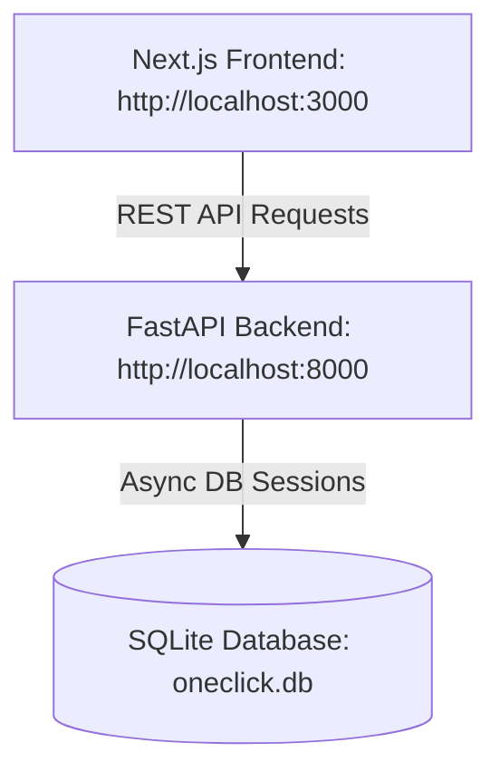

# 📑 Оцінка архітектури та Звіт готовності OneClick до запуску MVP

Цей звіт містить детальний аналіз поточної архітектури платформи **OneClick** (FastAPI backend + Next.js frontend), оцінку готовності системи до запуску в реальний тест (MVP) та покроковий список завдань для підготовки до релізу.

---

## 🏛️ Огляд архітектури системи

Наразі OneClick спроєктовано за класичною трирівневою архітектурою:
1. **Frontend (Клієнт)**: Додаток на **Next.js 16 (Turbopack)** з використанням React та TailwindCSS. Має адаптивний інтерфейс для виконавців (B2C, орієнтований на мобільні) та роботодавців (B2B, орієнтований на десктоп).
2. **Backend (Сервер)**: Асинхронний веб-сервер на **FastAPI**, розділений на роутери (`auth`, `shifts`, `disputes`), який спілкується з базою даних через **SQLAlchemy 2.0 (Async)**.
3. **Database (База даних)**: Локальна база **SQLite** (`oneclick.db`), інтегрована через асинхронний драйвер `aiosqlite`.

---

## 🔍 Оцінка компонентів та архітектурні рекомендації

### 1. База даних (Database)
*   **Поточний стан**: Використовується SQLite. Таблиці створюються автоматично при запуску сервера (через `Base.metadata.create_all` у lifespan). Завантажені тестові дані (seed data) для швидкого старту.
*   **Оцінка**: SQLite — чудовий вибір для швидкої розробки та MVP на одному сервері. Проте, при великій кількості одночасних запитів на запис (наприклад, бронювання змін багатьма користувачами) SQLite може блокувати базу.
*   **Рекомендація до запуску**:
    *   **Перейти на PostgreSQL**: Завдяки SQLAlchemy переход на Postgres потребує лише зміни рядка підключення (`DATABASE_URL`) у файлі конфігурації.
    *   **Міграції баз даних**: Додати **Alembic** для керування схемою бази даних замість автоматичного створення таблиць в коді.

### 2. Бекенд (FastAPI Backend)
*   **Поточний стан**: Дуже якісно написаний асинхронний код.
    *   Використовуються Pydantic-схеми для валідації запитів та відповідей.
    *   Реалізовано безпечне блокування рядків у базі даних при бронюванні через `select(...).with_for_update()`, що запобігає проблемі подвійного бронювання (race conditions).
*   **Оцінка**: Бекенд структурований правильно, роутери логічно розділені.
*   **Рекомендація до запуску**:
    *   **Справжня автентифікація**: Наразі після перевірки Google ID токена або SMS сервер просто повертає профіль користувача. Необхідно додати створення та повернення підписаного **JWT Access Token** у заголовках (або HTTP-only Cookie), щоб захистити решту ендпоінтів від несанкціонованого доступу.
    *   **Зберігання файлів (Фотозвіти)**: Зараз у `/shifts/{shift_id}/checkout` параметр `photo_url` приймає звичайний рядок. Для MVP потрібно підключити завантаження файлів у хмару (наприклад, **AWS S3** або **Cloudinary**).

### 3. Фронтенд (Next.js Frontend)
*   **Поточний стан**: Інтерфейс виглядає дуже сучасно, має темну й світлу теми, анімації, підтримку Дія та Google авторизації.
*   **Оцінка**:
    *   Головна проблема — **«Божественний хук» (God Hook)** `useSandbox.ts` (понад 1100 рядків коду). Він тримає в собі абсолютно весь стан додатка: від поточного юзера до чатів диспутів, балансів та фільтрів. Це ускладнює масштабування та перевикористання коду.
    *   Величезні файли компонентів (`WorkerView.tsx` має 115 КБ).
*   **Рекомендація до запуску**:
    *   **Декомпозиція стану**: Розбити `useSandbox.ts` на декілька контекстів React:
        *   `AuthContext` (дані користувача, логін, логаут)
        *   `ShiftContext` (список змін, бронювання, чек-іни)
        *   `DisputeContext` (диспути, повідомлення арбітражу)
    *   **Розподіл компонентів**: Винести окремі великі секції (наприклад, вкладка Wallet, ShiftCard, FeedFilters) в окремі дрібніші UI-компоненти.

---

## 🛠️ Що потрібно зробити для повноцінного запуску MVP

Нижче наведено пріоритетний список завдань, розбитий за категоріями, для переходу платформи в режим "Production":

### 1. Безпека та Сесії (Критично)
- [ ] **JWT Авторизація**: Замінити перевірку авторизації через `localStorage` на роботу з JWT-токенами, що зберігаються в безпечних `httpOnly` куках.
- [ ] **Middleware на бекенді**: Додати перевірку токена (Dependency Injection у FastAPI) для всіх чутливих маршрутів (бронювання змін, виведення балансу, чати диспутів).
- [ ] **CORS**: Замінити дозволені походження `allow_origins=["*"]` на реальний домен вашого MVP.

### 2. Сховище для медіафайлів (Висока важливість)
- [ ] **Завантаження фотозвітів**: Створити ендпоінт `/upload` на бекенді, який прийматиме файл зображення з камери виконавця (при чек-ауті), завантажуватиме його в хмарне сховище (AWS S3, Google Cloud Storage або Cloudinary) та повертатиме реальну URL-адресу для збереження в базі даних.

### 3. Сповіщення та Інтерактивність (Середня важливість)
- [ ] **WebSockets для чатів**: Зараз повідомлення в диспутах оновлюються через регулярні опитування (polling) раз на 4 секунди. Для MVP цього може вистачити, але для кращого досвіду варто перевести чат арбітражу на WebSockets.
- [ ] **SMS-шлюз**: Інтегрувати реальний сервіс розсилки SMS (наприклад, Turbosms, Twilio або Infobip) у файлі `auth.py` замість статичного симульованого коду `4815`.

### 4. Інфраструктура та Деплой (Середня важливість)
- [ ] **Конфігураційні файли**: Винести всі константи (секрети Google Client ID, секретний ключ JWT, налаштування бази даних) у файли `.env` та налаштувати їхнє зчитування через `pydantic-settings` на бекенді.
- [ ] **Docker-контейнеризація**: Створити `Dockerfile` для фронтенду та бекенду, щоб забезпечити однакове середовище під час розробки та деплою на сервер (наприклад, VPS).

---

> [!NOTE]  
> Поточна версія OneClick повністю готова для показу та тестування як інтерактивний **Sandbox/Демо-версія**. Вона імітує весь життєвий цикл роботи платформи (від авторизації Дія/Google до вирішення спорів арбітром). Для переходу до реального тестування (MVP) найпершим кроком має бути налаштування JWT-сесій та підключення реального SMS-шлюзу.
