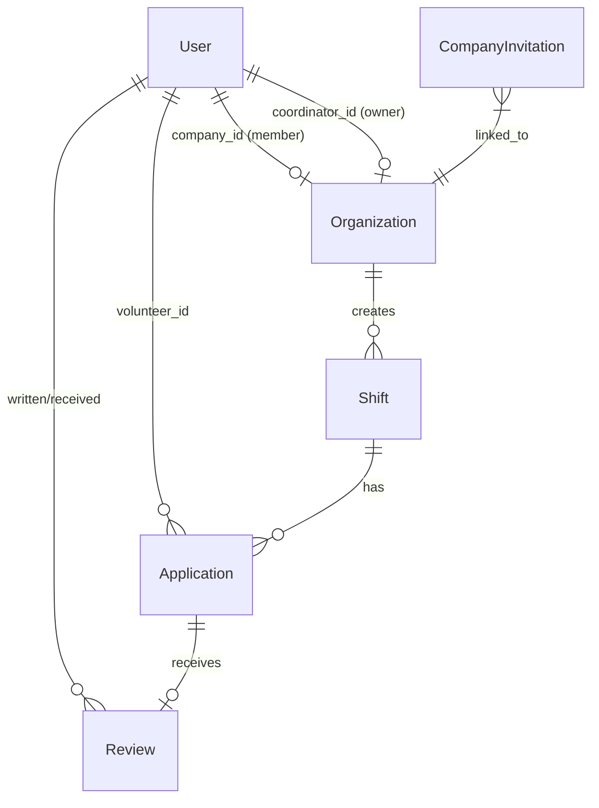

# Подробная архитектура и логика проекта OneClick

Этот документ содержит полное техническое описание проекта **OneClick** — платформы быстрого и удобного волонтерства. Он предназначен для разработчиков и больших языковых моделей (LLM) для быстрого ввода в курс дела: что, зачем и как устроено в кодовой базе.

---

## 1. Общий обзор системы (High-Level Overview)

**OneClick** — это двухсторонняя платформа (B2C + B2B):
*   **B2C (Волонтеры):** Студенты или активные граждане, которые ищут разовые задачи (смены) в своем городе. Они откликаются на задачи, подтверждают свое присутствие на месте с помощью QR-кода/секретного кода и получают отзывы/рейтинг от организаторов.
*   **B2B (Организаторы/Координаторы):** Компании, фонды, студенческие советы или локальный бизнес (например, кофейни), которым нужны волонтеры. Они создают смены, одобряют кандидатов, фиксируют их приход и оценивают качество их работы.

Проект построен по клиент-серверной архитектуре и полностью упакован в Docker-контейнеры для деплоя на VPS.

---

## 2. Технологический стек (Tech Stack)

### Фронтенд (Client)
*   **React 19 + Vite:** Быстрая среда сборки и библиотека компонентов.
*   **Zustand:** Глобальный стейт-менеджер. Все сетевые вызовы к API, состояние сессии пользователя, тосты и кэш данных изолированы в едином хранилище `store/useStore.js`.
*   **React Router (HashRouter):** Маршрутизация на стороне клиента. Хэш-роутер выбран для корректной работы путей на статических серверах без сложной настройки перенаправлений.
*   **Leaflet & OpenStreetMap:** Интерактивные карты для выбора и отображения адреса проведения смены.
*   **Tailwind CSS (v4):** Современная утилитарная стилизация интерфейса.

### Бэкенд (Server)
*   **FastAPI:** Высокопроизводительный асинхронный веб-фреймворк на Python.
*   **SQLAlchemy 2.0:** ORM для объектно-реляционного маппинга базы данных.
*   **Alembic:** Декларативное управление миграциями и схемой БД.
*   **PyJWT:** Генерация и проверка сессионных JSON Web Tokens.
*   **Bcrypt:** Надежное хеширование паролей координаторов (B2B) с солью.
*   **Pillow (PIL):** Обработка и сжатие загружаемых аватарок пользователей до формата WebP.

### СУБД (Database)
*   **PostgreSQL (Production):** Надежная СУБД с поддержкой конкурентных транзакций.
*   **SQLite (Development):** Легковесная локальная база данных для разработки.

---

## 3. Архитектура Базы Данных (Database Models)

Связи между таблицами описаны в файле `backend/models.py`.



### Модели в деталях:

1.  **User (`users`):**
    *   `id` (PK)
    *   `name`, `email` (индексирован), `phone` (индексирован), `password` (хеш bcrypt для B2B), `avatar_url` (путь к аватарке).
    *   `role`: 'B2C' (волонтер) или 'B2B' (координатор).
    *   `company_id` (FK -> `organizations.id`): Ссылка на организацию, в которой состоит пользователь.
    *   `company_role`: Роль внутри организации ('owner', 'manager', 'member').
2.  **Organization (`organizations`):**
    *   `id` (PK)
    *   `name`, `description`, `address`.
    *   `coordinator_id` (FK -> `users.id`): Владелец/создатель организации.
3.  **Shift (`shifts`):**
    *   `id` (PK)
    *   `title`, `category` (сфера), `date` (YYYY-MM-DD), `time` (например, "09:00 - 18:00"), `location` (зал/кабинет), `address` (физический адрес), `description`.
    *   `status`: 'open' (открыта для откликов) или 'closed' (завершена/заполнена).
    *   `max_volunteers` (лимит мест, по умолчанию 1-5).
    *   `organization_id` (FK -> `organizations.id`)
    *   `created_by_id` (FK -> `users.id`): Аудит-поле (кто именно создал смену).
4.  **Application (`applications`):**
    *   `id` (PK)
    *   `shift_id` (FK -> `shifts.id`)
    *   `volunteer_id` (FK -> `users.id`)
    *   `status`: Текущая стадия отклика волонтера. Принимает значения:
        *   `pending` (ожидает одобрения координатором)
        *   `approved` (одобрен, приглашен на смену)
        *   `rejected` (отклонен)
        *   `attended` (присутствие подтверждено кодом)
        *   `reviewed` (оценен координатором, смена завершена для него)
    *   `check_in_code` (unique, index): Уникальный 6-значный код (например, "1C-XXXX"), который генерируется для волонтера при одобрении заявки.
5.  **Review (`reviews`):**
    *   `id` (PK)
    *   `application_id` (FK -> `applications.id`)
    *   `author_id` (FK -> `users.id`): Кто написал (координатор).
    *   `target_id` (FK -> `users.id`): Кого оценили (волонтер).
    *   `rating` (1-5), `comment`.
6.  **CompanyInvitation (`company_invitations`):**
    *   `id` (PK)
    *   `organization_id` (FK -> `organizations.id`)
    *   `token` (unique UUID): Ссылка-приглашение.
    *   `email` (опционально, для кого предназначено).
    *   `role`: Назначаемая роль ('member', 'manager').
    *   `expires_at` (время жизни ссылки — 48 часов).
    *   `is_used` (флаг одноразовости).
7.  **OTPCode (`otp_codes`):**
    *   `id` (PK)
    *   `target` (телефон или почта).
    *   `code` (4-значный код верификации).
    *   `expires_at` (10 минут).
    *   `is_used`.

---

## 4. Основные Бизнес-Процессы и Логика

### 🔑 Процесс Авторизации и OTP (Двухфакторный вход)
1.  **Запрос кода:**
    *   Волонтер (B2C) вводит телефон. Ему отправляется СМС с кодом верификации.
    *   Координатор (B2B) вводит почту. Ему отправляется Email с кодом.
2.  **Запись в БД:** Код сохраняется в таблицу `otp_codes` с флагом `is_used = False` и временем истечения. Действует ограничение отправки (Rate Limit) — не чаще одного раза в 60 секунд.
3.  **Проверка и логин:**
    *   Если пользователь новый: он вводит OTP-код + имя, создается новый аккаунт.
    *   Если пользователь существующий B2C: он заходит по OTP-коду.
    *   Если пользователь существующий B2B: он заходит по связке **Email + Пароль** (в целях защиты бизнес-профилей от перехвата СМС/писем). Если у существующего пользователя не установлен пароль (например, зашел ранее через Google Auth), то при попытке авторизоваться как B2B система **обязательно** потребует ввести OTP-код для первой установки пароля.
4.  **JWT-Сессия:** При успешном входе бэкенд возвращает JWT-токен, содержащий `user_id`. Клиент сохраняет его в `localStorage` и прикрепляет к заголовку `Authorization: Bearer <token>` во всех последующих запросах.

### 📅 Жизненный Цикл Смены и Откликов
1.  **Создание:** Координатор создает смену с ограничением `max_volunteers`.
2.  **Отклик:** Волонтер находит смену на главном экране и откликается. Статус заявки устанавливается в `pending`.
3.  **Одобрение/Отклонение:** Координатор видит список заявок в кабинете B2B. Он может зайти в профиль волонтера, посмотреть его прошлые отзывы и средний рейтинг.
    *   При одобрении статус меняется на `approved`, волонтеру генерируется уникальный `check_in_code`.
    *   При отклонении статус становится `rejected`.
4.  **Подтверждение присутствия (Check-in):** Волонтер приходит на смену и показывает координатору свой 6-значный `check_in_code` (или QR-код). Координатор вводит его в своем кабинете. Бэкенд проверяет код, меняет статус заявки на `attended`.
5.  **Отзыв и закрытие:** Координатор пишет отзыв и выставляет оценку от 1 до 5. Статус заявки меняется на `reviewed`. Если все заявки на смену перешли в статус `reviewed` или `rejected` (или наступил следующий день после проведения смены), смена автоматически закрывается (`status = closed`).

### 🏢 Управление Организацией (B2B Команда)
*   **Создание:** Индивидуальный пользователь может зарегистрировать компанию. Он становится владельцем (`company_role = 'owner'`).
*   **Приглашение коллег:** Владелец или менеджер генерирует ссылку-токен.
*   **Принятие запроса:** Другой пользователь переходит по ссылке. Если он состоял в другой организации:
    *   Если он менеджер/участник: система переспрашивает и переводит его.
    *   Если он владелец: система предупреждает, что его текущая организация и все ее смены будут безвозвратно удалены.
*   **Управление ролями:** Владелец может повысить участника до менеджера, удалить участника из команды или передать права владельца. При выходе или удалении из организации роль пользователя сбрасывается назад на волонтера (`B2C`).

---

## 5. Структура Фронтенда (Zustand & Routing)

Весь интерфейс построен на реактивных компонентах React.

### Точки входа:
*   [main.jsx](file:///c:/Users/Dima/Desktop/OneK/src/main.jsx) — монтирует корневой компонент.
*   [App.jsx](file:///c:/Users/Dima/Desktop/OneK/src/App.jsx) — оборачивает приложение в `HashRouter` и распределяет маршруты:
    *   `/login` — экраны входа и регистрации, восстановление пароля, OTP верификация.
    *   `/volunteer/search` — поиск смен для волонтера с фильтрами по датам и категориям.
    *   `/volunteer/myshifts` — список активных и прошедших смен, на которые откликнулся волонтер, показ QR-кодов.
    *   `/volunteer/profile` — профиль волонтера, статистика выполненных смен, отзывы, загрузка аватарок.
    *   `/coordinator/manage` — кабинет координатора: список кандидатов на одобрение, чек-ин волонтеров по коду, выставление оценок.
    *   `/coordinator/create` — форма создания новой смены с выбором адреса на интерактивной карте Leaflet.
    *   `/coordinator/profile` — настройки профиля организации, список участников команды, генерация ссылок-приглашений.

### Состояние ([useStore.js](file:///c:/Users/Dima/Desktop/OneK/src/store/useStore.js)):
Хранит:
*   Текущего пользователя `user` и компанию `organization`.
*   Массивы данных: `shifts`, `bookedShifts`, `b2bApplications`, `b2bShifts`, `orgMembers`.
*   Метод `apiCall`: универсальная обертка над `fetch`, которая автоматически подставляет JWT-токен авторизации в заголовки и обрабатывает ошибки 401 (разлогинивает пользователя при истечении сессии).

---

## 6. Docker-окружение и развертывание (Deployment)

Деплой основан на контейнеризации всех сервисов.

### Схема взаимодействия контейнеров:

```
                  [Браузер пользователя]
                            │  порт 80 (HTTP)
                            ▼
                  ┌───────────────────┐
                  │  nginx-frontend   │ (Служит статику фронта)
                  └─────────┬─────────┘
             /api/* │       │ /static/*
                    ▼       ▼
           ┌───────────────────────────┐
           │     fastapi-backend       │ (Логика на FastAPI)
           └────────────┬──────────────┘
                        │ порт 5432
                        ▼
           ┌───────────────────────────┐
           │        postgres-db        │ (База данных PostgreSQL)
           └───────────────────────────┘
```

### Конфигурационные файлы:
1.  [docker-compose.yml](file:///c:/Users/Dima/Desktop/OneK/docker-compose.yml):
    *   Сервис `db` (PostgreSQL 15) с монтированием тома `pgdata` на хост для персистентности данных.
    *   Сервис `backend` собирает FastAPI-приложение. Монтирует том `uploads-data` для сохранения загруженных аватарок.
    *   Сервис `frontend` собирает статический билд фронтенда через Vite и запускает его под управлением Nginx.
2.  [nginx.conf](file:///c:/Users/Dima/Desktop/OneK/nginx.conf):
    *   Слушает порт 80.
    *   Маршрут `/` отдает собранный статический HTML/JS фронтенда.
    *   Маршрут `/api/` перенаправляет (проксирует) запросы в контейнер бэкенда (`proxy_pass http://backend:8000/api/`), что предотвращает любые проблемы с кросс-доменными CORS-запросами в браузере.
    *   Маршрут `/static/` проксирует запросы картинок (аватарок) на бэкенд.
3.  [.dockerignore](file:///c:/Users/Dima/Desktop/OneK/.dockerignore):
    *   Исключает локальные папки зависимостей и песочницу из контекста сборки, обеспечивая сборку контейнеров за секунды.
